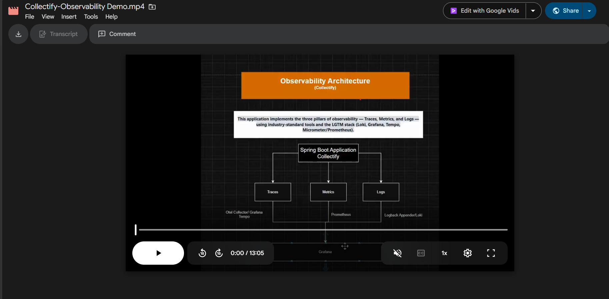

# Collectify

A Spring Boot REST API for managing collectible artifacts and their owners. Collectify provides a full-featured backend with JWT-based authentication, role-based access control, and a leaderboard system that ranks owners by their artifact count.

---

## Table of Contents

- [Features](#features)
- [Tech Stack](#tech-stack)
- [Getting Started](#getting-started)
- [Authentication](#authentication)
- [API Reference](#api-reference)
  - [User API](#user-api)
  - [Artifact API](#artifact-api)
  - [Owner API](#owner-api)
- [Observability](#observability)
- [Project Structure](#project-structure)
- [Running with Docker](#running-with-docker)
- [Configuration](#configuration)

---

## Features

- Full CRUD for **Artifacts**, **Owners**, and **Users**
- JWT Bearer token authentication with Redis-backed token whitelist
- HTTP Basic Auth login flow
- Assign artifacts to owners
- Owner leaderboard ranked by artifact count
- Artifact summary endpoint
- Role-based access control (`user`, `admin`)
- Global exception handling with consistent JSON error responses
- Full observability: traces, metrics, and logs via the LGTM stack
- Swagger/OpenAPI documentation
- Docker and Docker Compose support

---

## Tech Stack

| Technology | Purpose |
|---|---|
| Java 17+ | Programming language |
| Spring Boot | Backend framework |
| Spring Security | Authentication & authorization |
| Spring Data JPA | ORM / database persistence |
| Redis | JWT token whitelist |
| PostgreSQL | Production database |
| H2 | In-memory database for development/testing |
| JWT (RSA) | Stateless authentication tokens |
| OpenTelemetry + Micrometer | Distributed tracing |
| Prometheus | Metrics scraping |
| Grafana Loki | Log aggregation |
| Grafana Tempo | Trace storage |
| Grafana | Unified observability dashboard |
| Swagger/OpenAPI 3.0 | API documentation |
| Docker / Docker Compose | Containerization |
| Maven | Build tool |
| JUnit & Mockito | Testing |

---

## Getting Started

### Prerequisites

- Java 17+
- Maven
- Docker & Docker Compose (for the full stack)

### Run Locally

```bash
git clone https://github.com/Shivang-Kumar/hogwarts-artifacts-online.git
cd hogwarts-artifacts-online

# Start the application (dev profile)
./mvnw spring-boot:run -Dspring-boot.run.profiles=dev
```

The API will be available at `http://localhost:8080`.

Swagger UI: `http://localhost:8080/swagger-ui.html`

---

## Authentication

Collectify uses a two-step authentication flow:

**1. Register a new user**

```http
POST /api/v1/users
Content-Type: application/json

{
  "username": "john@gmail.com",
  "password": "MyPass@1",
  "roles": "user"
}
```

**2. Login to get a JWT token**

Send HTTP Basic Auth credentials to the login endpoint:

```http
POST /api/v1/users/login
Authorization: Basic <base64(username:password)>
```

Response:
```json
{
  "flag": true,
  "code": 200,
  "message": "Login Success",
  "data": "eyJhbGciOiJSUzI1NiJ9..."
}
```

**3. Use the token**

Include the JWT in the `Authorization` header for all protected endpoints:

```
Authorization: Bearer <your-jwt-token>
```

**4. Logout**

```http
POST /api/v1/users/logout
Authorization: Bearer <your-jwt-token>
```

This removes the token from the Redis whitelist, immediately invalidating it.

> **Public endpoints** (no auth required): `GET /api/v1/artifacts`
>
> **Basic Auth only**: `POST /api/v1/users/login`
>
> **Bearer token required**: all other protected endpoints

---

## API Reference

All responses follow a consistent envelope format:

```json
{
  "flag": true,
  "code": 200,
  "message": "Operation Success",
  "data": { ... }
}
```

### User API

| Method | Endpoint | Auth | Description |
|---|---|---|---|
| `POST` | `/api/v1/users` | Public | Register a new user |
| `POST` | `/api/v1/users/login` | Basic Auth | Login and receive JWT token |
| `POST` | `/api/v1/users/logout` | Bearer | Logout and invalidate JWT |
| `GET` | `/api/v1/users` | Bearer | Get all users |
| `GET` | `/api/v1/users/{id}` | Bearer | Get user by ID |
| `PUT` | `/api/v1/users/{id}` | Bearer | Update user |
| `DELETE` | `/api/v1/users/{id}` | Bearer | Delete user |

**Example — Update User**

```http
PUT /api/v1/users/1
Authorization: Bearer <token>
Content-Type: application/json

{
  "username": "john-updated",
  "enabled": true,
  "roles": "admin user"
}
```

---

### Artifact API

| Method | Endpoint | Auth | Description |
|---|---|---|---|
| `GET` | `/api/v1/artifacts` | Public | Get all artifacts |
| `GET` | `/api/v1/artifacts/{id}` | Bearer | Get artifact by ID |
| `GET` | `/api/v1/artifacts/summary` | Bearer | Get a summary of all artifacts |
| `POST` | `/api/v1/artifacts` | Bearer | Create a new artifact |
| `PUT` | `/api/v1/artifacts/{id}` | Bearer | Update an artifact |
| `DELETE` | `/api/v1/artifacts/{id}` | Bearer | Delete an artifact |

**Example — Create Artifact**

```http
POST /api/v1/artifacts
Authorization: Bearer <token>
Content-Type: application/json

{
  "name": "Rembrall",
  "description": "A small glass ball that glows red when the owner has forgotten something.",
  "imageUrl": "https://example.com/rembrall.png"
}
```

---

### Owner API

| Method | Endpoint | Auth | Description |
|---|---|---|---|
| `GET` | `/api/v1/owners` | Bearer | Get all owners |
| `GET` | `/api/v1/owners/{ownerId}` | Bearer | Get owner by ID |
| `POST` | `/api/v1/owners` | Bearer | Create a new owner |
| `PUT` | `/api/v1/owners/{ownerId}` | Bearer | Update an owner |
| `DELETE` | `/api/v1/owners/{ownerId}` | Bearer | Delete an owner |
| `PUT` | `/api/v1/owners/{ownerId}/artifacts/{artifactId}` | Bearer | Assign artifact to owner |
| `GET` | `/api/v1/owners/leaderboard` | Bearer | Get owners ranked by artifact count |
| `GET` | `/api/v1/owners/leaderboard/{ownerId}` | Bearer | Get a specific owner's rank |

**Example — Assign Artifact to Owner**

```http
PUT /api/v1/owners/1/artifacts/51232456489892569
Authorization: Bearer <token>
```

**Example — Leaderboard**

```http
GET /api/v1/owners/leaderboard?limit=10
Authorization: Bearer <token>
```

---

## Observability

## 🎥 Demo Video

[](https://drive.google.com/file/d/1tLSsnLHn7KoqGHjXV2kga15OTQnIPhpz/view?usp=sharing)

Collectify implements the three pillars of observability — **Traces**, **Metrics**, and **Logs** — using the LGTM stack.

```
├── Traces  ──► OTel Collector ──► Grafana Tempo  ──► Grafana
├── Metrics ──► Prometheus     ────────────────────► Grafana
└── Logs    ──► Grafana Loki   ────────────────────► Grafana
```

### Distributed Tracing

Tracing uses OpenTelemetry with the Micrometer bridge, exporting spans via OTLP to the OTel Collector → Grafana Tempo. A custom `@Traced` annotation enables manual span creation via AOP:

```java
@Traced("artifact.findById")
public Artifact findById(String id) { ... }
```

### Logging

Logs ship to Loki via `loki-logback-appender`, enriched with `traceId` and `spanId` for precise log-trace correlation. A custom `@Logged` annotation auto-logs method entry, exit, execution time, and exceptions:

```java
@Logged
public Artifact findById(String id) { ... }
```

### Metrics

Exposed at `/actuator/prometheus`, scraped every 30 seconds. Key custom metrics:

| Metric | Type | Description |
|---|---|---|
| `artifacts_operations_total` | Counter | Tracks `searched`, `created`, `deleted` operations |
| `auth_attempts_total` | Counter | Tracks `success`, `login_failure`, `token_failure` |

The Grafana dashboard covers JVM memory, CPU, HTTP request rate, error rate, response time, database connections, artifact operations, and auth attempts.

---

## Project Structure

```
src/
└── main/
    ├── java/
    │   └── com.example.collectify/
    │       ├── config/
    │       ├── controller/
    │       ├── service/
    │       │   └── impl/
    │       ├── repository/
    │       ├── model/
    │       ├── dto/
    │       ├── mapper/
    │       ├── exception/
    │       ├── security/
    │       └── CollectifyApplication.java
    └── resources/
        ├── application.yml
        ├── application-dev.yml
        └── application-prod.yml

└── test/
    └── java/
        └── com.example.collectify/
            ├── controller/
            ├── service/
            └── repository/
```

---

## Running with Docker

Start the full stack including the application, database, and observability tooling:

```bash
# Development
docker compose -f docker-compose-dev.yml up -d

# Production
docker compose -f docker-compose-prod.yml up -d
```

| Service | URL |
|---|---|
| Collectify API | http://localhost:8080 |
| Swagger UI | http://localhost:8080/swagger-ui.html |
| Grafana | http://localhost:3000 |
| Prometheus | http://localhost:9090 |
| Grafana Tempo | http://localhost:3200 |
| Grafana Loki | http://localhost:3100 |

---

## Configuration

Key settings configurable via Spring profiles (`dev` / `prod`):

| Property | Dev | Prod |
|---|---|---|
| OTLP endpoint | `http://localhost:4318/v1/traces` | Injected via environment variable |
| Trace sampling | `1.0` (100%) | `0.1` (10%) |
| Database | H2 (in-memory) | PostgreSQL |
| Environment tag | `dev` | `prod` |

---

## License

This project is open source. See [LICENSE](LICENSE) for details.
